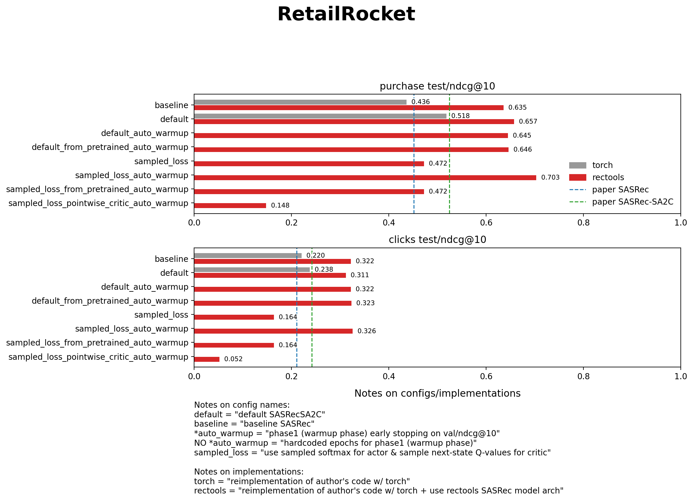
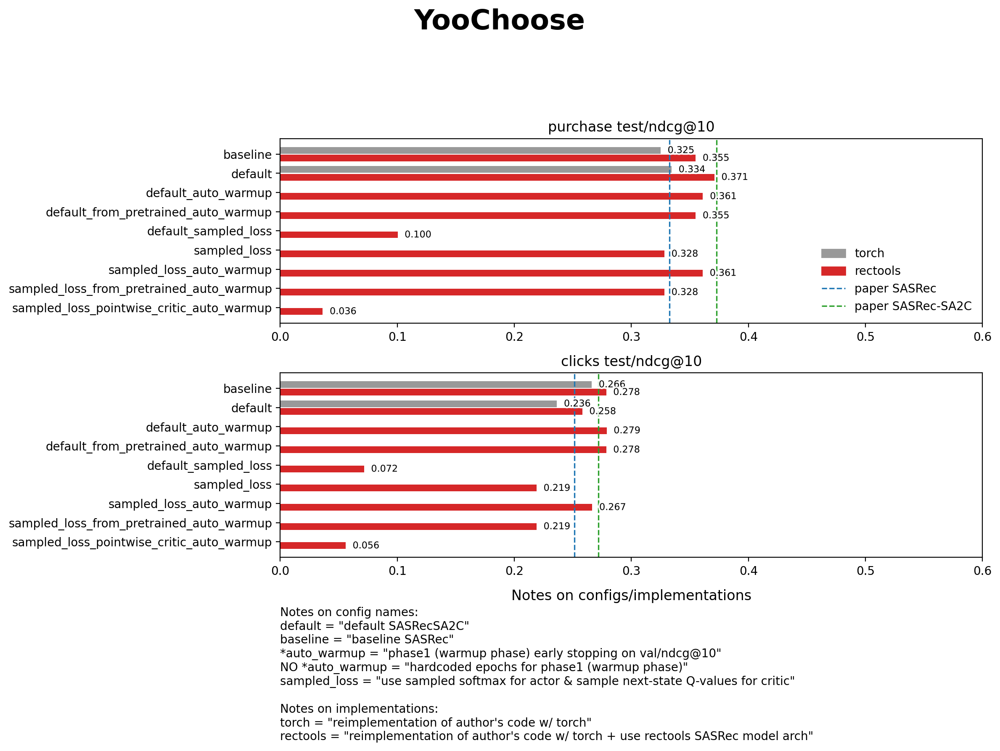

# SA2C (SASRec) — Torch + RecTools reimplementation

### Results

Plots are generated by `scripts/plot_test_results.py` and saved under `results/plots/`.

#### RetailRocket

#### YooChoose (RC15)

#### persrec_tc5_2025-08-21 (bert4rec_eval)

