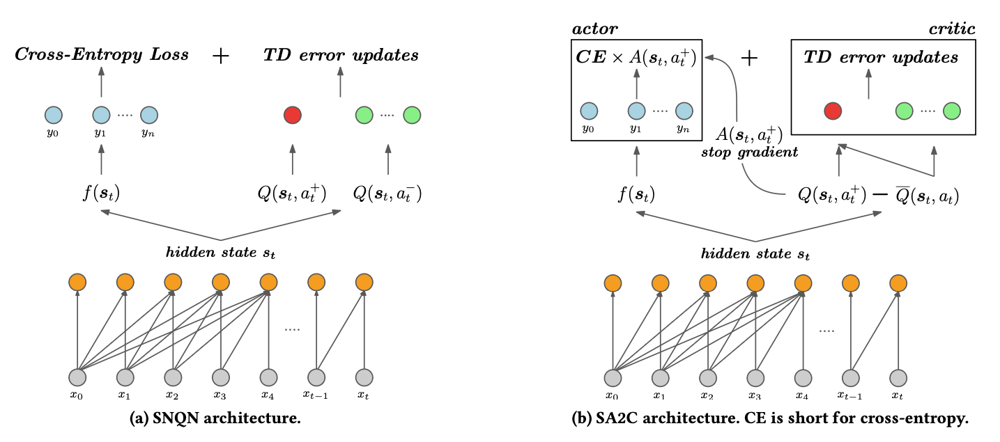
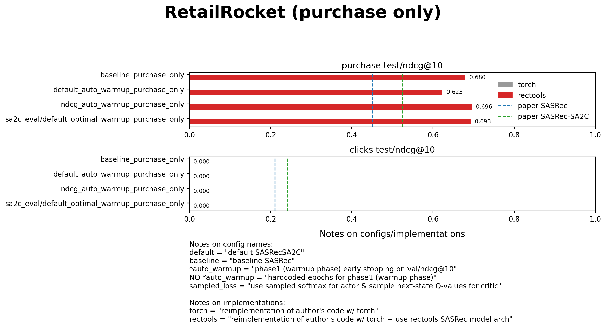
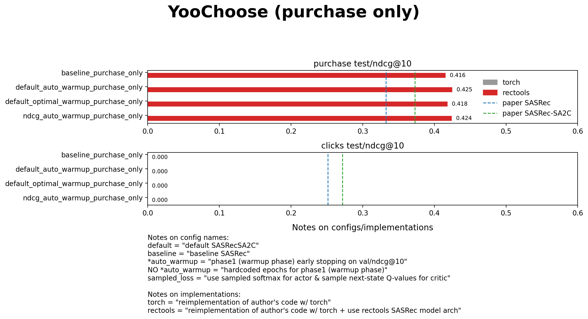

# Supervised Advantage Actor-Critic (SA2C)

## Overview

This repo reproduces results of paper [SA2C](https://arxiv.org/abs/2111.03474) using SASRec implementation based on [RecTools](https://github.com/MobileTeleSystems/RecTools).

We also test NDCG-based reward and ablate for purchase-only data.



## Overview

This repo reproduces results of paper [SA2C](https://arxiv.org/abs/2111.03474) using SASRec implementation based on [RecTools](https://github.com/MobileTeleSystems/RecTools).

We also test NDCG-based reward and ablate for purchase-only data.


## Contents

  - [Clicks and puchases results](#clicks-and-puchases-results)
    - [RetailRocket (all events)](#retailrocket-all-events)
    - [YooChoose (all events)](#yoochoose-all-events)
  - [Purchase-only results](#purchase-only-results)
    - [RetailRocket (purchase-only)](#retailrocket-purchase-only)
    - [YooChoose (purchase-only)](#yoochoose-purchase-only)
  - [Notes](#notes)


### Clicks and puchases results

#### RetailRocket (all events)


#### YooChoose (all events)


### Purchase-only results

#### RetailRocket (purchase-only)



#### YooChoose (purchase-only)



### Notes

For full list of commands to reproduce experiments refer to `COMMANDS.md`

Plots were generated by
```bash
python scripts/plot_test_results.py --max-metric-value 1.0 0.6 0.3
```